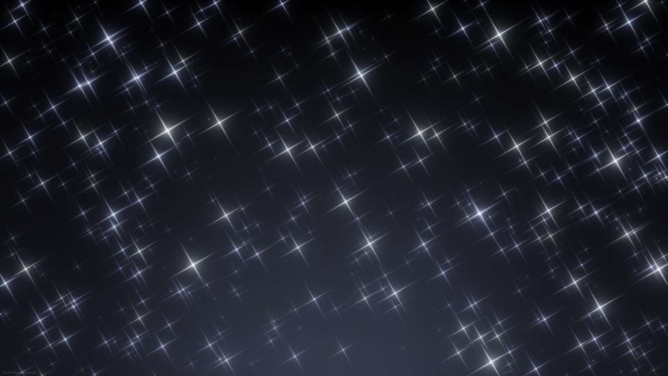
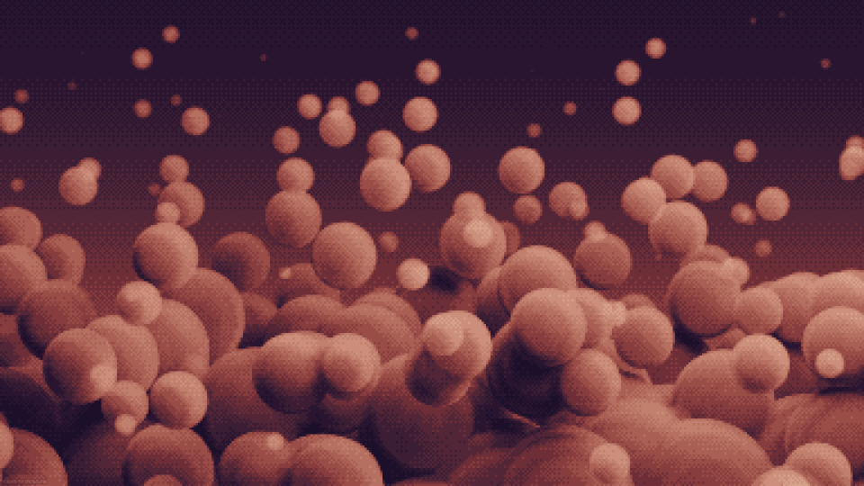

# 2024 MDDN242 Assignment 3
## Concept
For this project, I was tasked with training an AI masking tool to separate portions of an image and selectively apply image effects with code, portraying a visual narrative or concept.

My concept for this project was to show a transformation of an environment into a new one. I was inspired by the daily walk to campus in the morning, talking the same route back and forth each time. It gets boring after a while, and it's easy for my brain to go on autopilot, forgetting the small details that make each trip unique. Taking the time to view things in a different way and take notice of the small details could make the daily commute more interesting.

The sky and the Earth's day/night cycle has a huge impact on the way the environment looks and how humans behave in it. It dictates our routines and our circadian rhythm. When the colour of the sky changes, so does the way the environment looks, letting us see it in a way that is different from how we are used to. It reflects the idea of viewing something through a unique lens and watching how it can paint a situation differently from before.

I portrayed this concept by taking photos of city buildings on my way to and from class, and using the AI masking tool to separate the sky from the ground, and applying effects and filters to the sky while influencing the imagery around it, letting me transform a familiar environment into a new one.
## Development
Since the code is designed to iterate over the canvas and operate on each pixel individually, I had to create functions for my visuals from scratch. The first was a gradient function that would smoothly paint colours across the canvas.

I adapted a linear gradient function to work with my code to achieve this, where I can define a set of gradient presets, each containing a set of colour stops and a line to stretch them across. My gradient presets show off a variety of styles, representing rare forms that the sky could be in, like a orange sunset, or a bright green aurora.

My code blends between the colours appropriately based on where each pixel is located. Firstly, it projects the pixel onto the line to find out where it lies across the gradient. Then, it finds the two colour stops it falls between and its proximity to each to calculate how much of each colour needs to be blended into the pixel.

p5.js uses the RGB colour space by default, which results in decent-looking gradients, but the LAB colour space creates much nicer transitions between colours that are more accurate to the human eye. I adapted [this code](https://github.com/antimatter15/rgb-lab/tree/master) to convert the interpolated LAB colours to the RGB colour space to achieve this.

I created some presets that distribute streaks, stars, or rings in the sky for some added variation. These are drawn to a black and white offscreen buffer, which is then used to lighten or darken pixels in the gradient before they are converted to RGB colour. This lightening is performed on the L channel of the LAB colour of each pixel, which controls the lightness. Drawing graphics into the sky like this offers more accurate and vibrant colours than simply painting a translucent white on top.

I explored a few ways to lessen the impact of the mask's inaccuracies. Firstly, I attempted to randomly offset the X and Y coordinates each time a given pixel in the mask was sampled, creating fuzzy edges in the mask. However, the mask was primarly black or white pixels, and the resulting effect was too noisy.

I tried using a box blur filter to smooth out the edges of the mask, but it was too resource-intensive to iterate over so many pixels. Instead, I opted for a dither pattern defined earlier in the code that blends over the colours in the mask, creating a bias in how much of the sky or ground is shown in any given pixel, alleviating the harsh transitions. The nature of the dither pattern also allows the vibrant graphics in the sky to subtly appear in the environment like a reflection, which helps with the next part of the process.

To let the sky influence the environment, reinforcing my concept, my code iterates over each of the colour stops in the selected gradient preset, and averages the colours to produce a single colour. This colour is then multiplied into each pixel of the environment. The result tints the environment in a colour that reflects the sky in a similar way to how it would appear in real life. Furthermore, a posterisation effect is added to the environment, limiting its colour palette and integrating it with the dither pattern effect for a subtle pixel art feel.
## Inspiration
My inspiration for the kinds of effects and filters I used in my project the come from designs I have made in the past, specifically the stars and the pixel-art style.

